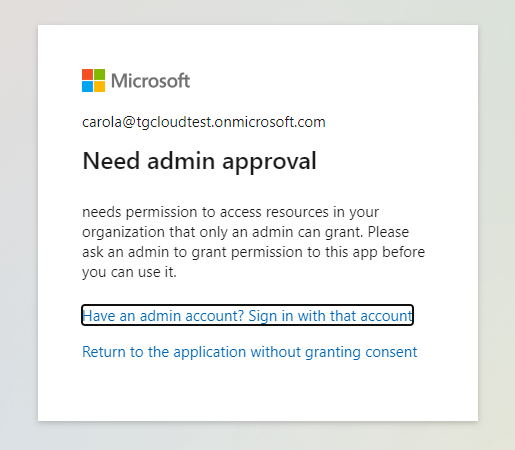

# Embed for your organization (also known as user owns data)  
The application allows you to integrate data, reports, dashboards, and tiles that are accessible to users in your organization when they sign in using their own Power BI accounts. In this type of application, the users own the data that you embed.

### API Permissions:
- Add premissions
- Power BI Service
- Delegated permissions
  - `Report.Read.All`
  - `Dataset.ReadWrite.All`
  - `App.Read.All`

`carola@tgcloudtest.onmicrosoft.com`  
`Tujo121743`  
`October4!~>`  

`nicolecruz@tgcloudtest.onmicrosoft.com`
`Poko311284`

# Considerations and limitations
- Additional manual inputs to the button aren't supported.
- The visual isn't supported for **embedded analytics.**
- The visual doesn't work in Publish to Web (public) scenarios, because unauthenticated scenarios aren't supported by Power Automate.
- The visual doesn't support export scenarios.
- The Power Automate visual is limited to process a maximum of 1000 records.
- The user running the flow within the Power BI report needs to have permissions to run the flow. Grant these permissions through direct sharing by the user or by sharing to a Microsoft Entra group.
- Create flows that you will use with the Power BI button trigger directly within the Power BI report. Avoid going directly to Power Automate to create these flows, as the - trigger will not have access to the data fields necessary for creating the flow.
- Power BI data is sent to, and processed in, a geography where the flow is deployed.

### Comparison Table

| Feature                | Embed for Organization                       | Embed for Customers                        | iFrame                                       |
| ---------------------- | -------------------------------------------- | ------------------------------------------ | -------------------------------------------- |
| **Authentication**     | Single Sign-On (SSO)                         | Can use custom sign-in methods             | May require re-login                         |
| **User Management**    | Managed via Azure AD                         | Custom user management available           | No built-in user management                  |
| **Security**           | Strong security with Azure AD integration    | Potential security risks if not managed    | Security risks (e.g., clickjacking)          |
| **Row-Level Security** | Yes, supports row-level security             | Yes, but requires careful setup            | Limited or no support                        |
| **Customization**      | Limited customization options                | Custom branding and UI adjustments         | Limited customization                        |
| **Integration**        | Seamless with Microsoft ecosystem            | Can integrate with custom applications     | Limited integration capabilities             |
| **Setup Complexity**   | Requires Azure AD and Power BI configuration | More complex due to custom user management | Simple and quick setup                       |
| **Accessibility**      | Internal users only                          | Accessible to external users               | Login using Power BI Account                 |
| **Pipeline Trigger**   | Can execute workflows with session token     | Requires explicit permissions setup        | Limited capability                           |
| **Email Sending**      | Can send emails using session token          | Can send emails, but requires user setup   | Not directly supported                       |
| **User Experience**    | Seamless experience for internal users       | Tailored experience for custom users       | Basic content display; limited interactivity |

  

 